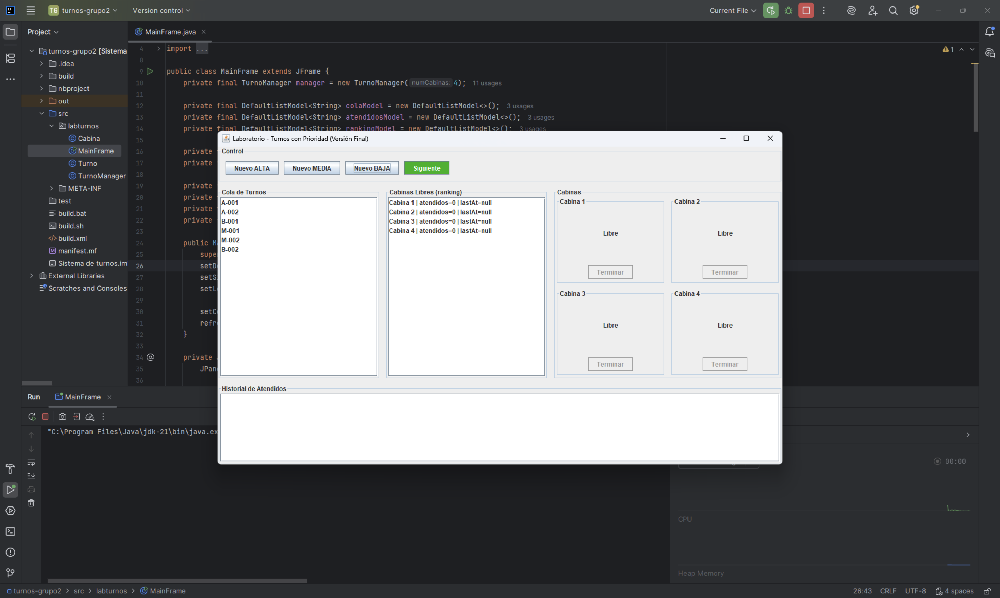
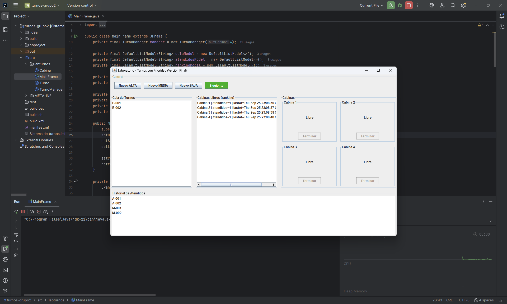

# 🧑‍🔬 LabTurnos - Sistema de Turnos con Prioridad

Este proyecto es una aplicación de escritorio en **Java Swing** para la gestión de turnos en un laboratorio.  
Permite administrar cabinas de atención, dar turnos con distintas prioridades y llevar un historial de atendidos.

---


---

## 👥 Información del equipo
- **Grupo:** G2  
- **Integrantes:**  
  - Kevin Andres Cuzco Ochoa 
  - Richard Paul Larco Mena
- **Curso/Asignatura:** Estructura de datos  
- **Docente:** Ing. Lessette Carolina Zambrano Zurita 

---

## 📝 Descripción del problema
En el laboratorio clínico de la universidad, la asignación de turnos se realiza manualmente, lo que genera:  
- Desorganización en la cola de espera.  
- Falta de priorización de casos urgentes.  
- Dificultad para llevar un historial de pacientes atendidos.  

---

## 💡 Solución propuesta
Se desarrolló **LabTurnos**, una aplicación de escritorio en **Java Swing** que:  
- Administra turnos con **tres niveles de prioridad** (Alta, Media, Baja).  
- Gestiona **4 cabinas de atención simultáneas**.  
- Ordena la cola de espera automáticamente según prioridad.  
- Asigna turnos a cabinas libres siguiendo un **ranking dinámico**.  
- Mantiene un **historial de turnos atendidos**.  

---

## ▶️ Instrucciones de ejecución
1. Requisitos previos:  
   - **Java JDK 8 o superior**  
   - IDE recomendado: IntelliJ IDEA o NetBeans  

2. Clonar el repositorio:  
   ```bash
   git clone https://github.com/dohko722/labturnos.git
   cd labturnos


## 🚀 Características

- **Gestión de turnos con prioridad**:
  - Alta
  - Media
  - Baja
- **Cabinas de atención**:
  - 4 cabinas simultáneas
  - Ranking dinámico de cabinas libres (por número de atendidos y último turno finalizado).
- **Cola de espera** ordenada según prioridad.
- **Historial de turnos atendidos**.
- **Interfaz gráfica con Swing**:
  - Botones de control para generar turnos y avanzar en la cola.
  - Vista en tiempo real de cabinas ocupadas/libres.
  - Botón **Siguiente** que se activa solo cuando hay turnos pendientes y cabinas disponibles.

---

## 📦 Estructura del proyecto

```
labturnos/
│── MainFrame.java        # Ventana principal con la interfaz gráfica
│── Turno.java            # Clase que representa un turno (ID, prioridad, etc.)
│── Cabina.java           # Clase que representa una cabina de atención
│── TurnoManager.java     # Lógica de negocio: manejo de la cola, cabinas y atendidos
```

---


## 🖥️ Capturas de pantalla

### 🎫 Cola de Turnos


### 🏥 Cabinas de Atención


### 📜 Historial de Atendidos



---

## 🔧 Requisitos

- **Java JDK 8 o superior**
- IDE recomendado: **IntelliJ IDEA** (aunque funciona en cualquier IDE que soporte proyectos Java)

---

## ▶️ Ejecución

1. Clonar este repositorio:
   ```bash
   git clone https://github.com/tuusuario/labturnos.git
   cd labturnos
   ```
2. Compilar y ejecutar desde tu IDE (ejecuta la clase `MainFrame`) o desde terminal:
   ```bash
   javac labturnos/*.java
   java labturnos.MainFrame
   ```

---

## 📖 Uso

1. Crear un nuevo turno con los botones:
   - `Nuevo ALTA`
   - `Nuevo MEDIA`
   - `Nuevo BAJA`
2. Presionar **Siguiente** para asignar el siguiente turno a la cabina más adecuada.
3. Finalizar la atención en una cabina con el botón **Terminar**.
4. Consultar en todo momento:
   - La **cola de espera**
   - El **ranking de cabinas**
   - El **historial de turnos atendidos**

---

## 👨‍💻 Autor

- Desarrollado por Grupo2  
- Proyecto académico de práctica en **Java Swing**

---

## 📜 Licencia

Este proyecto se distribuye bajo la licencia MIT.  
Eres libre de usarlo, modificarlo y compartirlo.
