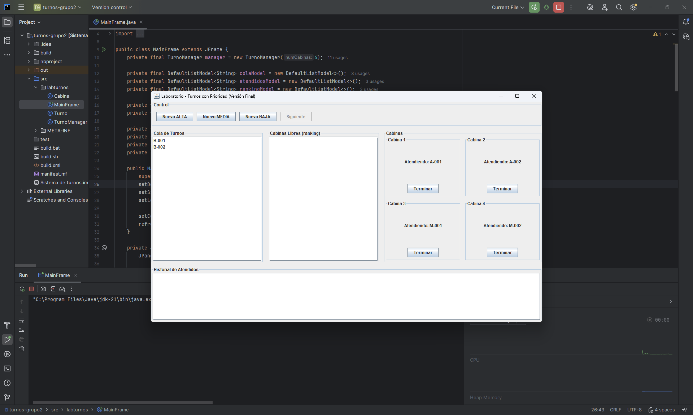

# 🧑‍🔬 LabTurnos - Sistema de Turnos con Prioridad

Este documento es una **plantilla base** del README para el proyecto académico **LabTurnos**.  
Debe ser completado y ajustado por el grupo con su propio contenido definitivo.  

---


---

## 👥 Información del equipo
- **Grupo:** G2  
- **Integrantes:**  
  - Kevin Andres Cuzco Ochoa 
  - Richard Paul Larco Mena
- **Curso/Asignatura:** Estructura de datos  
- **Docente:** Ing. Lessette Carolina Zambrano Zurita 

---

## 📝 Descripción del problema
En el laboratorio clínico de la universidad, la asignación de turnos se realiza manualmente, lo que genera:  
- Desorganización en la cola de espera.  
- Falta de priorización de casos urgentes.  
- Dificultad para llevar un historial de pacientes atendidos.  

---

## 💡 Solución propuesta
Se desarrolló **LabTurnos**, una aplicación de escritorio en **Java Swing** que:  
- Administra turnos con **tres niveles de prioridad** (Alta, Media, Baja).  
- Gestiona **4 cabinas de atención simultáneas**.  
- Ordena la cola de espera automáticamente según prioridad.  
- Asigna turnos a cabinas libres siguiendo un **ranking dinámico**.  
- Mantiene un **historial de turnos atendidos**.  

---

## ▶️ Instrucciones de ejecución
1. Requisitos previos:  
   - **Java JDK 8 o superior**  
   - IDE recomendado: IntelliJ IDEA o NetBeans  

2. Clonar el repositorio:  
   ```bash
   git clone https://github.com/tuusuario/labturnos.git
   cd labturnos
   ```

3. Compilar y ejecutar:  
   ```bash
   javac labturnos/*.java
   java labturnos.MainFrame
   ```

---

## 🏗️ Arquitectura del código

```
labturnos/
│── MainFrame.java        # Ventana principal con la interfaz gráfica
│── Turno.java            # Clase que representa un turno (ID, prioridad, etc.)
│── Cabina.java           # Clase que representa una cabina de atención
│── TurnoManager.java     # Lógica de negocio: manejo de la cola, cabinas y atendidos
│── screenshots/          # Carpeta con capturas de pantalla
```

---

## 🖥️ Capturas de pantalla

### 🎫 Cola de Turnos


### 🏥 Cabinas de Atención


### 📜 Historial de Atendidos


---

## 🧪 Casos de prueba

1. **Prueba de prioridades**:  
   Crear turnos de diferentes niveles (Alta, Media, Baja) y verificar que la cola se ordene correctamente.  

2. **Prueba de cabinas**:  
   Finalizar un turno en una cabina y comprobar que el siguiente con mayor prioridad sea asignado a la cabina libre.  

3. **Prueba de historial**:  
   Atender más de 10 turnos y revisar que todos pasen al historial con su cabina y hora de atención.  

4. **Prueba de botón "Siguiente"**:  
   Verificar que solo se active cuando existen turnos pendientes y al menos una cabina disponible.  

---

## 📊 Resultados

- Se logró reducir la desorganización en la asignación de turnos.  
- Se garantiza la **atención prioritaria** de casos urgentes.  
- Se cuenta con un historial digital que facilita la **trazabilidad** de la atención.  
- La interfaz gráfica permite un uso sencillo por parte del personal del laboratorio.  

---

## 📚 Lecciones aprendidas

- La importancia de manejar estructuras de datos como **colas con prioridad**.  
- Cómo integrar la lógica de negocio con una **interfaz gráfica en Swing**.  
- La experiencia de trabajo en equipo y uso de **control de versiones con Git y GitHub**.  
- Planificación y organización en proyectos de **Estructura de Datos** aplicados a casos reales.  

---

## 🔗 Referencias

- [Documentación oficial de Java](https://docs.oracle.com/en/java/)  
- [Guía de Java Swing](https://docs.oracle.com/javase/tutorial/uiswing/)  
- Material de clase de la asignatura *Estructura de Datos*  

---

## 📜 Nota
Este documento es una **plantilla base**. Cada grupo debe **ajustar, personalizar y completar** el contenido con base en su propio proyecto.  
El archivo debe entregarse con el nombre:  

```
README_G2.md
```
